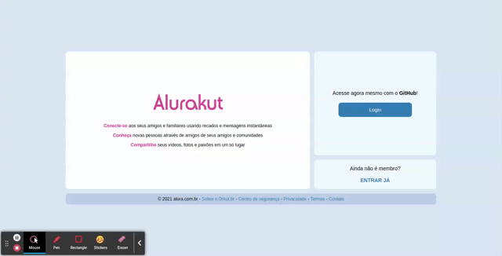

# imersao-alurakut

## Projeto da Semana de Imersão React da Alura.

Para o ver o site em funcionamento, acesse: https://imersao-alurakut.vercel.app/

Segui o roteiro da imersão, mas fiz algumas melhorias e adaptações:

- Login via OAuth
- Buscar completa de following e followers
- Página de following e followers, com filtros
- Página de comunidades
- Refatoração da estrutura de componentes
- Novos Hooks: useLogin, useFollowers, useCommunity, useMenu
- Adição de estados para indicação de loading/carregamento
- Adição de favicon

